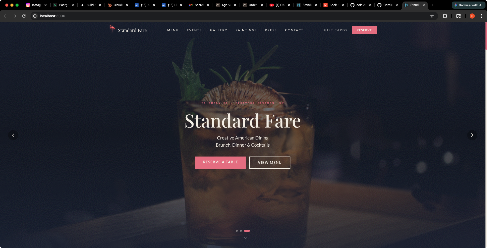
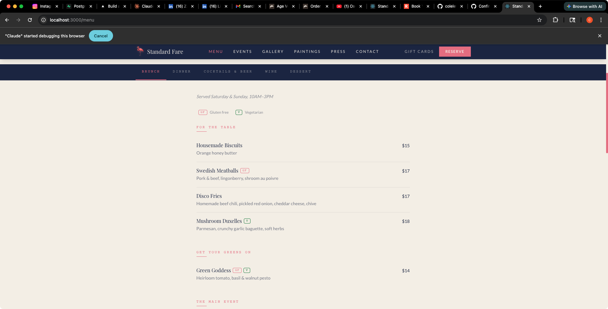
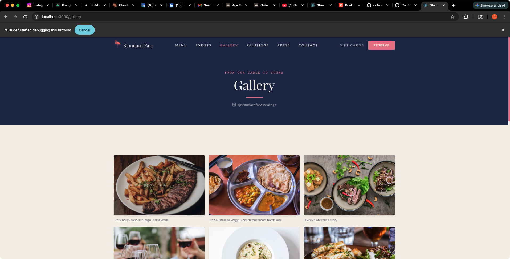
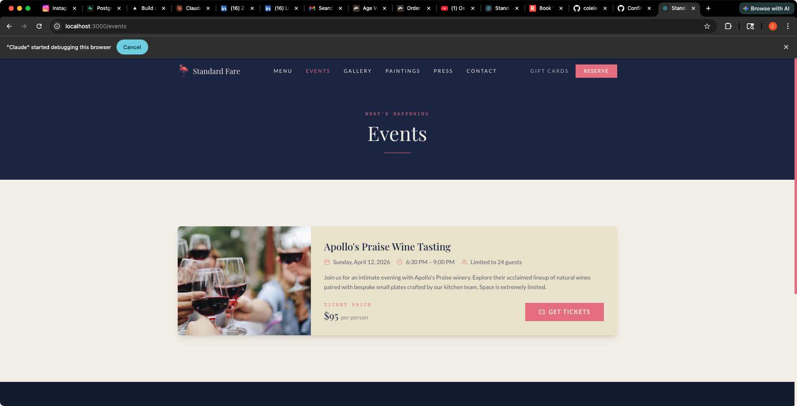

<div align="center">

# Standard Fare

**Creative American Dining**

21 Phila St, Saratoga Springs, NY

[](https://react.dev)
[](https://tailwindcss.com)
[](https://supabase.com)
[](https://vercel.com)
[]()

A modern, fully-editable restaurant website with a built-in CMS, cloud-synced content, integrated e-commerce, and automated social feeds.

[View Live](https://standardfaresaratoga.com) · [Admin Panel](/admin) · [Toast Integration](./README-TOAST.md)

</div>

---



---

## Table of Contents

- [Screenshots](#screenshots)
- [Features](#features)
- [Tech Stack](#tech-stack)
- [Getting Started](#getting-started)
- [Environment Variables](#environment-variables)
- [Admin Panel](#admin-panel)
- [Automated Integrations](#automated-integrations)
- [E-Commerce & Cart](#e-commerce--cart)
- [Deployment](#deployment)
- [Supabase Setup](#supabase-setup)
- [Project Structure](#project-structure)
- [Brand Guidelines](#brand-guidelines)

---

## Screenshots

<table>
<tr>
<td width="50%">

**Menu — Brunch**



</td>
<td width="50%">

**Gallery**



</td>
</tr>
<tr>
<td width="50%" colspan="2">

**Events**



</td>
</tr>
</table>

---

## Features

<table>
<tr>
<td width="50%">

**Front of House**
- Full-screen hero slideshow with editable text & CTAs
- Dynamic menus — brunch, dinner, cocktails, wine, dessert with PDF download
- On-site pickup ordering — browse menu, add items, checkout (separate cart from shop)
- Instagram-linked photo gallery with lightbox
- Auto-pulled Instagram feed — 3 most recent posts, refreshed every 12 hours
- Real Google Reviews — scraped automatically, 5-star only, 12-hour refresh
- Ticketed events with Resy/Toast integration
- Artist paintings shop with auto-import from Big Cartel + stock limits
- Daniel Fairley product showcase with artist bio
- Branded merchandise store with variants and sizing
- Blog / "From the Kitchen" — chef stories, sourcing, behind-the-scenes (SEO)
- Press coverage with publication logos + downloadable press kit
- Private events inquiry form with structured fields
- Real-time Resy table availability widget
- Gift card purchase page + balance checker (via Toast API)
- "This Week's Features" — highlighted dishes on homepage
- FAQ page — accordion-style with category filters
- Happy hour / specials banner with live countdown timer
- Hours override banner for holidays & closures
- Seasonal menu countdown banner
- Email newsletter signup (Mailchimp / Klaviyo)
- Multi-language support (EN, ES, FR, ZH, JA)
- Team bios with executive chef profile card
- Hours table with live "Today" highlight
- Embedded Google Map & contact form with department routing
- Dual shopping carts — merch/bottles/prints cart + separate pickup order cart
- Stock-aware inventory — paintings limited to 1, sold-out items blocked
- JSON-LD structured data for Google rich results
- OpenGraph / Twitter social sharing cards

</td>
<td width="50%">

**Back of House**
- Full CMS admin panel at `/admin`
- Edit every section — no code required
- Image uploads to Supabase Storage
- Password-protected preview gate
- Dual persistence: Supabase cloud + localStorage fallback
- Automatic sync & conflict resolution
- Draft mode — stage changes locally, publish when ready
- One-click force refresh for Instagram feed, Google reviews, and paintings
- Blog editor — create posts with tags, author, and role
- Weekly features editor — highlight dishes on the homepage
- FAQ editor — add/remove/reorder Q&A items with categories
- Hours override toggle — holiday closures and special hours
- Specials editor — manage happy hour and daily deals
- Seasonal menu countdown toggle with date picker
- Email marketing settings (Mailchimp/Klaviyo provider config)
- Private events configuration (capacity, inclusions)
- Paintings section toggle with independent password protection
- Stock management — per-item inventory (connected to Toast when credentials set)
- URL sanitization prevents broken images
- Version-controlled data migrations
- One-click Supabase connection retry
- Owner guides: "How It Works" and "How It Brings Value" pages

</td>
</tr>
</table>

## Tech Stack

| Layer | Technology | Purpose |
|:------|:-----------|:--------|
| **Frontend** | React 19, React Router 7 | SPA with client-side routing |
| **Styling** | Tailwind CSS 3.4 | Utility-first responsive design |
| **Animations** | Framer Motion | Page transitions & micro-interactions |
| **Icons** | Lucide React | Consistent icon system |
| **Database** | Supabase (PostgreSQL) | Cloud content storage via JSONB |
| **File Storage** | Supabase Storage | Image & video uploads |
| **Deployment** | Vercel | Edge network with instant rollbacks |
| **Serverless** | Vercel Functions | Instagram, reviews, Big Cartel, Toast, Resy, email signup, gift cards, private events |
| **i18n** | Custom LanguageContext | 5-language support (EN, ES, FR, ZH, JA) |

## Getting Started

```bash
# Clone the repo
git clone https://github.com/colelevy08/standard-fare.git
cd standard-fare

# Install dependencies
npm install

# Add environment variables (see below)
cp .env.example .env

# Start dev server
npm start
```

Runs at **http://localhost:3000**

## Environment Variables

Create a `.env` file in the project root (see `.env.example`):

```env
# Required
REACT_APP_SUPABASE_URL=your_supabase_project_url
REACT_APP_SUPABASE_ANON_KEY=your_supabase_anon_key

# Optional
REACT_APP_PREVIEW_PASSWORD=your_preview_password

# Server-side only (set in Vercel, not .env for production)
TOAST_API_KEY=your_toast_api_key
TOAST_RESTAURANT_ID=your_restaurant_guid
MAILCHIMP_API_KEY=your_mailchimp_key        # or KLAVIYO_API_KEY
```

> See **[docs/CREDENTIALS-CHECKLIST.md](./docs/CREDENTIALS-CHECKLIST.md)** for a complete guide to obtaining all credentials.

> **Note:** Never commit `.env` to version control. The `.gitignore` already excludes it.

## Admin Panel

Navigate to `/admin` and log in to manage all site content — no code changes needed.

| Section | What You Can Edit |
|:--------|:------------------|
| **Hero** | Slideshow images, eyebrow text, title, tagline, CTA labels & links |
| **About** | Heading, body text, team bios, photos |
| **Menus** | Items, sections, pricing, GF/veg badges across all menus |
| **Gallery** | Photos with captions and Instagram links |
| **Instagram Feed** | Auto-pulled from @standardfaresaratoga every 12 hours; force refresh button; manual fallback |
| **Events** | Ticketed events with dates, pricing, and ticket URLs |
| **Paintings** | Artist works synced from Big Cartel; force refresh; password-protected visibility toggle |
| **Merchandise** | Branded items with variants, draft/published toggle |
| **Bottles** | Wine shop with pricing and descriptions |
| **Google Reviews** | Auto-pulled 5-star reviews; force refresh; staff mention prioritization |
| **Press** | Publication logos, headlines, article links |
| **Hours** | Open/close times per day of the week |
| **Hours Override** | Enable/disable holiday closure banner with custom message and dates |
| **Weekly Features** | "This Week's Features" — toggle, headline, featured dishes with tags and prices |
| **Specials** | Happy hour and daily specials with day/time scheduling |
| **FAQ** | Questions, answers, and categories — add, remove, reorder |
| **Location** | Address, phone, email, Google Maps embed |
| **Links** | Resy, DoorDash, Toast, Instagram URLs |
| **Contact** | Department-routed emails (Press, Private Events, General, Careers) |
| **Blog** | "From the Kitchen" posts — title, body, images, tags, author with role |
| **Seasonal Countdown** | Enable/disable countdown banner, set launch date and teaser text |
| **Email Marketing** | Enable signup form, configure Mailchimp/Klaviyo provider |
| **Private Events** | Capacity settings, "What's Included" checklist |
| **Settings** | Admin password, preview password, order button toggle, paintings toggle |

> For Toast POS integration (event tickets, print sales, merchandise), see **[README-TOAST.md](./README-TOAST.md)**

## Automated Integrations

These features run automatically with no manual intervention:

| Feature | Source | Refresh | Admin Override |
|:--------|:-------|:--------|:---------------|
| **Instagram Feed** | @standardfaresaratoga via `/api/instagram-feed` | Every 12 hours | Force refresh button in admin |
| **Google Reviews** | Google via Wanderlog scrape at `/api/google-reviews` | Every 12 hours | "Pull from Google" button in admin |
| **Paintings Catalog** | Big Cartel (poemdexter) via `/api/bigcartel-products` | Daily | "Sync Now" button in admin |
| **Resy Availability** | Resy API via `/api/resy-availability` | Every 5 min (CDN) | Shown on Contact page |
| **Gift Card Balance** | Toast API via `/api/gift-card-balance` | Real-time | Checker on Contact page |

All auto-pulled data is cached in both localStorage (fast loads) and Supabase (cross-device persistence). The Vercel CDN also caches API responses with `stale-while-revalidate` for zero-downtime refreshes.

## E-Commerce & Cart

The site includes two independent cart systems:

### Shop Cart (`CartContext`)
- **Bottles** — wine shop with add-to-cart
- **Paintings** — artist prints with stock limits (1 per painting, sold-out items blocked)
- **Merchandise** — branded items with size/color variants
- **Event Tickets** — ticketed experiences

Stock-aware: items with a `stock` field cannot exceed that quantity. Paintings are unique originals (stock: 1). The cart drawer shows "Only 1 available" warnings and disables the + button at max stock.

### Pickup Cart (`PickupCartContext`)
- **Food Pickup Orders** — browse brunch/dinner/dessert menus, add items, checkout
- Completely independent from the shop cart
- Built-in checkout drawer with customer info form (name, phone, email, notes)
- Orders submitted to `/api/toast-order` with `orderType: "pickup"` for Toast fulfillment
- Payment collected at pickup

Both carts persist in localStorage. Shop checkout submits to `/api/toast-order` for fulfillment through the restaurant's Toast POS. Order history is saved locally so returning customers can view past orders (up to 50).

Once Toast credentials are connected, stock levels can be synced from the POS.

## Deployment

### Vercel (Recommended)

1. Push to GitHub
2. Import the repo at [vercel.com/new](https://vercel.com/new)
3. Set the three environment variables above
4. Deploy with these settings:

| Setting | Value |
|:--------|:------|
| **Framework Preset** | Create React App |
| **Build Command** | `npm run build` |
| **Output Directory** | `build` |

**Custom domain setup:**

```
A     @     →  76.76.21.21
CNAME www   →  cname.vercel-dns.com
```

Then in Vercel → Settings → Domains → Add `standardfaresaratoga.com`

## Supabase Setup

1. Create a [Supabase](https://supabase.com) project
2. Run the following SQL to create the content table:

```sql
CREATE TABLE site_content (
  id      INT PRIMARY KEY,
  content JSONB NOT NULL DEFAULT '{}'::jsonb
);
```

3. Create a **gallery** storage bucket (public access, 50MB limit, image/video MIME types)
4. Copy your project URL and anon key into `.env`

> The app automatically initializes the database row on first load — no seed script needed.

## Project Structure

```
standard-fare/
├── api/
│   ├── instagram-feed.js              Scrape latest 3 Instagram posts
│   ├── instagram-thumb.js             Extract og:image from individual posts
│   ├── google-reviews.js              Scrape 5-star Google reviews via Wanderlog
│   ├── bigcartel-products.js          Proxy Daniel Fairley's Big Cartel shop
│   ├── toast-order.js                 Submit orders to Toast POS
│   ├── gift-card-balance.js           Check gift card balance via Toast API
│   ├── email-signup.js                Email signup (Mailchimp / Klaviyo)
│   ├── private-events.js              Private event inquiry handler
│   └── resy-availability.js           Real-time Resy table availability
├── docs/
│   ├── CREDENTIALS-CHECKLIST.md       Post-sale credential setup guide
│   └── screenshots/                   README screenshots
├── public/
│   └── index.html                     Entry point + JSON-LD + OG tags
├── src/
│   ├── context/
│   │   ├── AdminContext.js            State management + Supabase sync + auth
│   │   ├── CartContext.js             Shop cart (bottles/merch/prints/tickets) with stock limits
│   │   ├── PickupCartContext.js       Separate cart for food pickup orders
│   │   └── LanguageContext.js         Multi-language i18n (EN/ES/FR/ZH/JA)
│   ├── data/
│   │   └── siteData.js                Default content (single source of truth)
│   ├── hooks/
│   │   ├── useInstagramFeed.js        Auto-pull Instagram feed with 12hr cache
│   │   ├── useGoogleReviews.js        Auto-pull Google reviews with 12hr cache
│   │   ├── useBigCartel.js            Auto-pull Big Cartel products with daily cache
│   │   ├── useMenuPdf.js              Generate printable menu PDF
│   │   └── useOrderHistory.js         localStorage-based order history (max 50)
│   ├── lib/
│   │   ├── supabase.js                Supabase client init
│   │   └── supabaseStorage.js         Image upload helpers
│   ├── components/
│   │   ├── layout/                    Navbar, Footer, PageLayout
│   │   ├── sections/                  Hero, About, Hours, Testimonials, Email, Countdown, Resy, GiftCard, SpecialsBanner
│   │   ├── cart/                      AddToCartButton, CartDrawer
│   │   └── ui/                        FlamingoIcon, PreviewGate, ImageUploader, LanguageSwitcher
│   ├── pages/
│   │   ├── HomePage.jsx               All homepage sections composed
│   │   ├── MenuPage.jsx               Tabbed multi-menu view + PDF download
│   │   ├── GalleryPage.jsx            Photo grid + Instagram feed + lightbox
│   │   ├── EventsPage.jsx             Ticketed events listing
│   │   ├── PrintsPage.jsx             Artist paintings shop
│   │   ├── BottleShopPage.jsx         Wine & beer bottle shop
│   │   ├── MerchPage.jsx              Branded merchandise store
│   │   ├── BlogPage.jsx               "From the Kitchen" blog listing
│   │   ├── BlogPostPage.jsx           Individual blog post view
│   │   ├── PressPage.jsx              Press coverage grid
│   │   ├── PressKitPage.jsx           Downloadable press kit + assets
│   │   ├── PrivateEventsPage.jsx      Private events inquiry form
│   │   ├── TeamPage.jsx               Full team page
│   │   ├── ContactPage.jsx            Contact form with department routing + gift card checker
│   │   ├── CheckoutPage.jsx           Cart summary + order form + order history
│   │   ├── OrderPage.jsx              On-site pickup ordering with menu browsing
│   │   ├── GiftCardsPage.jsx          Gift card purchase page
│   │   ├── FAQPage.jsx                Accordion FAQ with category filters
│   │   ├── AdminPage.jsx              Full CMS dashboard
│   │   ├── HowItWorksPage.jsx         Owner guide — managing the site
│   │   └── ValuePage.jsx              Owner guide — business value breakdown
│   ├── App.js                         Route definitions
│   └── index.css                      Tailwind directives + custom styles
├── tailwind.config.js                 Brand colors, fonts, animations
├── vercel.json                        SPA rewrite rules + security headers
├── README.md                          This file
├── README-TOAST.md                    Toast POS integration guide
└── README-SUPABASE.md                 Supabase setup details
```

## Brand Guidelines

<table>
<tr>
<td align="center"><br/><strong>Navy</strong><br/><code>#1B2B4B</code><br/>Backgrounds, text</td>
<td align="center"><br/><strong>Cream</strong><br/><code>#F5F0E8</code><br/>Light backgrounds</td>
<td align="center"><br/><strong>Flamingo Pink</strong><br/><code>#E8748A</code><br/>Accents, CTAs</td>
</tr>
</table>

| Role | Typeface | Usage |
|:-----|:---------|:------|
| **Headings** | Playfair Display | Page titles, section headers |
| **Body** | Lato | Paragraphs, descriptions, UI text |
| **Labels** | Courier Prime | Menu badges, category tags |

---

<div align="center">

**Standard Fare** · Saratoga Springs, NY · [@standardfaresaratoga](https://www.instagram.com/standardfaresaratoga/)

Built by [Cole Levy](https://www.linkedin.com/in/colelevy/)

</div>
